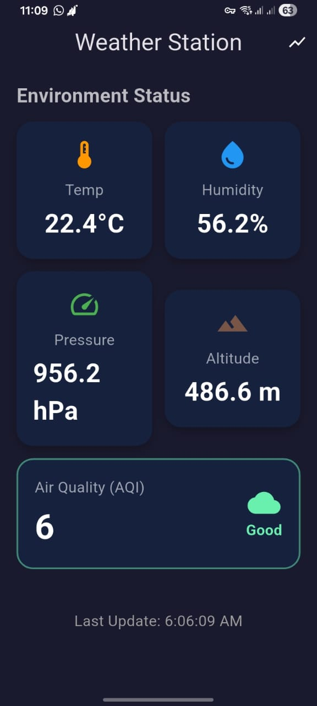
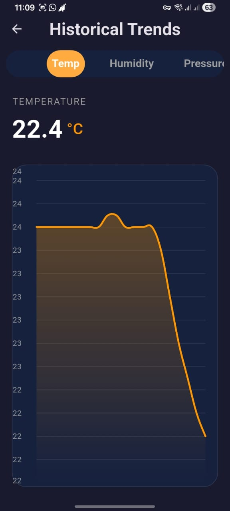

# 🌦️ IoT Real-Time Weather Station (Flutter + ESP32)

A full-stack IoT solution that monitors 5 environmental parameters in real-time. This project demonstrates a **Hybrid Architecture** combining **MQTT** for sub-second latency updates and **ThingSpeak (HTTP)** for historical data persistence.

## 🚀 Features
- **Real-Time Monitoring:** Instant updates via MQTT (Latency < 100ms).
- **Historical Analytics:** Interactive graphs showing trends over time using ThingSpeak API.
- **5-Sensor Array:** Monitors Temperature, Humidity, Pressure, Altitude, and Air Quality (AQI).
- **Smart Alerts:** Mobile app UI changes color dynamically based on air quality safety levels.
- **Dual Output:** Data is visualized simultaneously on a physical LCD and the Mobile App.

## 🏗️ System Architecture
The system uses an ESP32 microcontroller running non-blocking tasks to handle two network protocols simultaneously.

1.  **Sensors** read data (DHT22, BMP280, MQ135).
2.  **Task A (Fast):** Publishes JSON payloads to **HiveMQ Broker** every 1 second.
3.  **Task B (Slow):** Uploads data to **ThingSpeak Cloud** every 15 seconds.
4.  **Flutter App:** Subscribes to the MQTT topic for the dashboard and polls the ThingSpeak API for charts.

## 🛠️ Tech Stack

### Hardware
- **MCU:** ESP32 Development Board
- **Sensors:**
    - `DHT22` (Temp & Humidity)
    - `BMP280` (Pressure & Altitude)
    - `MQ135` (Air Quality / Gas)
- **Display:** 16x2 LCD with I2C Interface

### Software
- **Mobile App:** Flutter (Dart), `fl_chart`, `mqtt_client`, `http`
- **Firmware:** C++ (Arduino IDE)
- **Protocols:** MQTT (TCP/IP), HTTP (REST), I2C

## 🔌 Hardware Pinout

| Sensor | ESP32 Pin |
| :--- | :--- |
| **DHT22** | GPIO 4 |
| **MQ135** | GPIO 34 (Analog) |
| **LED Alert** | GPIO 12 |
| **SDA (LCD/BMP)** | GPIO 21 |
| **SCL (LCD/BMP)** | GPIO 22 |

## 📸 Screenshots

| Live Dashboard | Historical Charts |
| :---: | :---: |
|  |  |

*(Note: Upload your screenshots to a folder named 'screenshots' in your repo to make them appear here)*

## 👥 Contributors

This project was built as a semester project by:

* **Imadh Aboo Ubatih** - *Developer (App & Firmware)* - www.linkedin.com/in/imadh-ubaith-60a9a0317
* **Muhammad Ahmad Ameen** - *[Role: Hardware Interface]*
* **Ayesha Akthar** - *[Role: Documentation & Testing]*

## 📄 License
This project is open-source and available under the MIT License.
